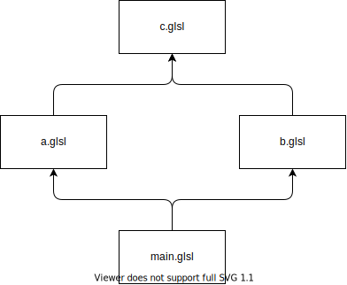
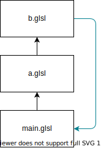

[](https://opensource.org/licenses/MIT)

# GLSL Assembler
GLSLAssembler is a tool for assembling multiple GLSL files linked via the `#include` directive. Its main features are:

- `#include <...>` for paths relative to a predefined root directory;
- `#include "..."` for paths relative to the current module;
- Topological ordering of the dependency graph;
- Detection of cyclic dependencies;
- Mapping lines of code in the assembled source;
- Hoisting of `#version` and `precision` (OpenGL ES);

C++11 or higher is required.

# Example
Given the following GLSL files:

main.glsl
```glsl
#include <a.glsl>
#include <b.glsl>

#version 300 es
precision mediump float;

out vec4 out_Color;
void main(void) {
    out_Color = vec4(1, 0, 0, 1);
}

```

a.glsl
```glsl
#include <c.glsl>

uint base_hash(uvec2 p) {
    p = 1103515245U*((p >> 1U)^(p.yx));
    uint h32 = 1103515245U*((p.x)^(p.y>>3U));
    return h32^(h32 >> 16);
}
```

b.glsl
```glsl
#include <c.glsl>

vec2 hash2(inout float seed) {
    uint n = base_hash(floatBitsToUint(vec2(seed+=.1,seed+=.1)));
    uvec2 rz = uvec2(n, n*48271U);
    return vec2(rz.xy & uvec2(0x7fffffffU))/float(0x7fffffff);
}

```

c.glsl
```glsl
vec2 c_func(inout float seed) {
    return vec2(2. * seed, seed);
}

```

GLSLAssembler builds the following dependency graph:



Next, the topological sort of the graph is computed:

  1. `c.glsl`
  2. `a.glsl`
  3. `b.glsl`
  4. `main.glsl`

Finally, the full assembled source is generated:

```glsl
#version 300 es
precision mediump float;
// MODULE BEGIN: c.glsl
vec2 c_func(inout float seed) {
    return vec2(2. * seed, seed);
}

// MODULE BEGIN: a.glsl
// #include <c.glsl>

uint base_hash(uvec2 p) {
    p = 1103515245U*((p >> 1U)^(p.yx));
    uint h32 = 1103515245U*((p.x)^(p.y>>3U));
    return h32^(h32 >> 16);
}

// MODULE BEGIN: b.glsl
// #include <c.glsl>

vec2 hash2(inout float seed) {
    uint n = base_hash(floatBitsToUint(vec2(seed+=.1,seed+=.1)));
    uvec2 rz = uvec2(n, n*48271U);
    return vec2(rz.xy & uvec2(0x7fffffffU))/float(0x7fffffff);
}

// MODULE BEGIN: main.glsl
// #include <a.glsl>
// #include <b.glsl>

// #version 300 es
// precision mediump float;

out vec4 out_Color;
void main(void) {
    out_Color = vec4(1, 0, 0, 1);
}
```

Notice how the original `#include` lines have been commented, and that `#version` and `precision` directives have been 
moved to the top of the file (hoisting). Also, in the assembled source each module is preceded by a `MODULE BEGIN` comment line.

# Line mapping
If the assembled file has errors, the GLSL compiler will report the line numbers relative to the whole assembled file. 
Going from the assembled file to the exact module/line manually is error-prone. 
To solve this problem, GLSLAssembler provides a utility to remap a line from the assembled source back into its original 
line and module.

# Dependency cycles


During the topological sort, if a cycle is detected an exception is thrown with the details of the cycle found:

    Dependency cycle: main.glsl --> a.glsl --> b.glsl --> main.glsl

# CMake usage

GLSLAssembler uses CMake as build tool. Available options are:

- `GLSLASSEMBLER_BUILD_SHARED_LIB`: if `ON` the library will be built as a shared library. This is not recommended  
  because the interfaces use STL objects (like `std::string`) which can cause problems if the C++ runtime library is not
  the same between the library and the application linking against it.

- `GLSLASSEMBLER_BUILD_DOCS`: if `ON` the documentation will be built (Doxygen is required).

- `BUILD_TESTING`: if `ON` the tests are built (Catch2 is required).

If your project uses CMake as well, you can link against GLSLAssembler with:

```cmake
    find_package(GLSLAssembler REQUIRED)
    target_link_library(your_main_target GLSLAssembler::GLSLAssembler)
```

# API usage
The main entrypoint is the `ModuleGraph` class, which is used to load and assemble a group of GLSL files.

```c++
#include <glsl_assembler/module_graph.h>
#include <glsl_assembler/module_loader.h>
#include <iostream>

void main() {
  ModuleGraph moduleGraph;

  // A ModuleGraph needs a ModuleLoader to actually load GLSL files
  MyModuleLoader loader;
  moduleGraph.setModuleLoader(&loader);

  // This is the base directory used for #include <...> directives
  moduleGraph.setIncludeDir("resources/shaders/example");
 
  try {
    // Load a GLSL script along with all its dependencies
    moduleGraph.loadModule("resources/shaders/example/main.glsl");

    // Get the assembled source with includes resolved
    const std::string &assembledSource = moduleGraph.getAssembledSource();

    // Map a line index (50, zero-based) in the assembled source to a module and its local line index.
    int moduleLine;
    Module *module = moduleGraph.mapLine(50, moduleLine);
    if (module) {
      // Mapping found! module->getId() is the full pathname
      std::cout << "Line " << (50 + 1) << " is from line " << (moduleLine + 1) << " of " << module->getId() << std::endl;
    } else {
      // Mapping not found, the index is either invalid or points to a MODULE BEGIN which does not exist
      // in the individual modules.
    }

    // The same instance can be reused, but keep in mind that old line mapping and assembled source
    // will be lost. Typically you use two ModuleGraph instances to load the vertex/fragment shaders.
    moduleGraph.loadModule("resources/shaders/other/other.glsl");

    // ...compile GLSL fragment/vertex shader...
    // ...remap line numbers...
  } catch (std::exception &ex) {
    // Error (typically a module that could not be loaded, or a dependency cycle)
    std::cerr << "An error occurred " << ex.what() << std::endl;
  }
}
```

# Module loading
In order to use `ModuleGraph`, it's necessary to provide an implementation of `ModuleLoader` interface:

```c++
    /**
     * Loads the GLSL file located at path.
     * Note: the returned string <strong>MUST</strong> use \\n as newline character.
     *
     * @param path the path of the resource to load.
     * @return the GLSL file contents.
     * @throws std::runtime_error if the resource cannot be loaded.
     */
    virtual std::string load(const std::string &path) = 0;

    /**
     * @param pathString the path string to check
     * @return true if the string is only a path, without filename
     */
    virtual bool isPath(const std::string &pathString) = 0;

    /**
     * Given a path name (path + filename), extracts the path part
     * @param pathName a path along with a filename (e.g. /my/path/file.glsl)
     * @return the path part
     */
    virtual std::string extractPath(const std::string &pathName) = 0;

    /**
     * Joins a path with a path name, which can be relative.
     * <p>A relative path can use ".." or ".", for example
     * <ul>
     * <li>../my/folder/file.glsl</li>
     * <li>../.././myfile.glsl</li>
     * </ul>
     * @param path the base path (never includes a filename)
     * @param pathName a path name, which can include special ".." and "." symbols
     * @return the joined path
     */
    virtual std::string join(const std::string &path, const std::string &pathName) = 0;
```

A basic implementation for `isPath()`, `extractPath()` and `join()` is provided by `SimpleModuleLoader`, which leaves
only `load()` to be implemented.  
Alternatively, C++17 `std::filesystem` provides an easy way to implement the required methods.

# Known issues
Include directives within a line comment are correctly ignored:

    // The inclusion will be ignored
    // #include <....>

but not when inside a block comment:

    /* The inclusion will NOT be ignored
        #include <....>
    */

Don't add anything (except whitespaces) before or after the include directive:

    #include <....> // This include is not recognized
    
